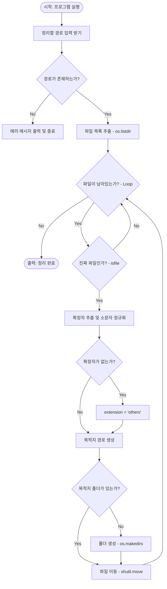

```mermaid
graph TD
    A([시작: 프로그램 실행]) --> B[정리할 경로 입력 받기]
    B --> C{경로가 존재하는가?}
    C -- No --> D[에러 메시지 출력 및 종료]
    C -- Yes --> E[파일 목록 추출 - os.listdir]
    E --> F{파일이 남아있는가? - Loop}
    F -- No --> G([출력: 정리 완료])
    F -- Yes --> H{진짜 파일인가? - isfile}
    H -- No --> F
    H -- Yes --> I[확장자 추출 및 소문자 정규화]
    I --> J{확장자가 없는가?}
    J -- Yes --> K[extension = 'others']
    J -- No --> L[목적지 경로 생성]
    K --> L
    L --> M{목적지 폴더가 있는가?}
    M -- No --> N[폴더 생성 - os.makedirs]
    M -- Yes --> O[파일 이동 - shutil.move]
    N --> O
    O --> F
```