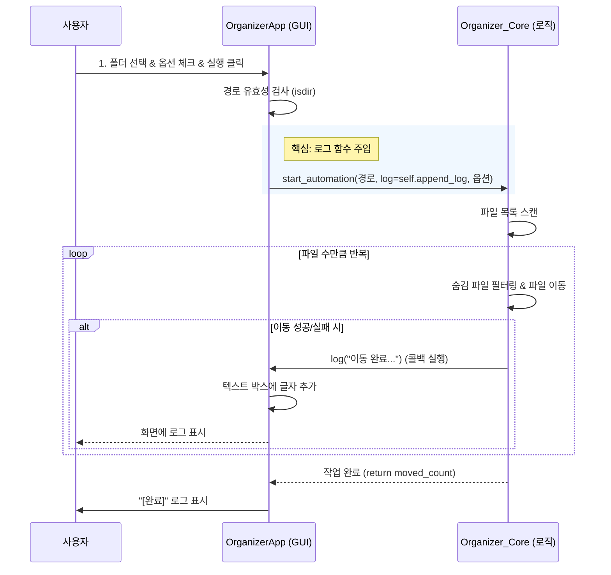

```mermaid
sequenceDiagram
    participant User as 사용자
    participant GUI as OrganizerApp (GUI)
    participant Core as Organizer_Core (로직)

    User->>GUI: 1. 폴더 선택 & 옵션 체크 & 실행 클릭
    GUI->>GUI: 경로 유효성 검사 (isdir)
    
    rect rgb(240, 248, 255)
        note right of GUI: 핵심: 로그 함수 주입
        GUI->>Core: start_automation(경로, log=self.append_log, 옵션)
    end
    
    Core->>Core: 파일 목록 스캔
    
    loop 파일 수만큼 반복
        Core->>Core: 숨김 파일 필터링 & 파일 이동
        
        alt 이동 성공/실패 시
            Core->>GUI: log("이동 완료...") (콜백 실행)
            GUI->>GUI: 텍스트 박스에 글자 추가
            GUI-->>User: 화면에 로그 표시
        end
    end
    
    Core-->>GUI: 작업 완료 (return moved_count)
    GUI->>User: "[완료]" 로그 표시
```