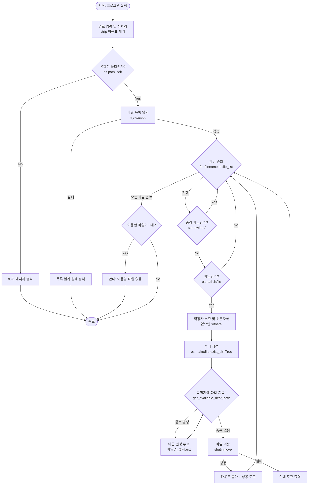

```mermaid
graph TD
    %% 초기 설정 및 입력 단계
    Start([시작: 프로그램 실행]) --> Input[경로 입력 및 전처리<br/>strip 따옴표 제거]
    Input --> IsDir{유효한 폴더인가?<br/>os.path.isdir}
    
    %% 폴더가 아닐 경우 종료
    IsDir -- No --> ErrorMsg[에러 메시지 출력] --> End([종료])
    
    %% 폴더일 경우 목록 추출
    IsDir -- Yes --> TryList[파일 목록 읽기<br/>try-except]
    TryList -- 실패 --> ListError[목록 읽기 실패 출력] --> End
    
    %% 메인 루프 시작
    TryList -- 성공 --> Loop{파일 순회<br/>for filename in file_list}
    
    %% 루프 종료 조건 및 결과 보고
    Loop -- 모든 파일 완료 --> CheckCount{이동한 파일이 0개?}
    CheckCount -- Yes --> NoMove[안내: 이동할 파일 없음] --> End
    CheckCount -- No --> End
    
    %% 1. 숨김 파일 체크 (v1 추가 기능)
    Loop -- 진행 --> Hidden{숨김 파일인가?<br/>startswith '.'}
    Hidden -- Yes --> Loop
    
    %% 2. 파일 여부 체크
    Hidden -- No --> IsFile{파일인가?<br/>os.path.isfile}
    IsFile -- No --> Loop
    
    %% 3. 확장자 처리 및 폴더 생성
    IsFile -- Yes --> ExtProc[확장자 추출 및 소문자화<br/>없으면 'others']
    ExtProc --> MakeDir[폴더 생성<br/>os.makedirs exist_ok=True]
    
    %% 4. 충돌 방지 로직 (v1 핵심 기능)
    MakeDir --> CheckDup{목적지에 파일 중복?<br/>get_available_dest_path}
    CheckDup -- 중복 발생 --> Rename[이름 변경 루프<br/>파일명_숫자.ext] --> CheckDup
    CheckDup -- 중복 없음 --> Move[파일 이동<br/>shutil.move]
    
    %% 5. 결과 처리
    Move -- 성공 --> Success[카운트 증가 + 성공 로그] --> Loop
    Move -- 실패 --> Fail[실패 로그 출력] --> Loop
```